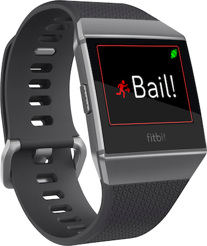

# Fitbit Bail Out

Nexmo :heart: Fitbit!

This is a sample watch app, companion app, and server demonstrating how to integrate the [Fitbit Ionic](https://www.fitbit.com/ie/ionic) with the [Nexmo Voice API](https://developer.nexmo.com/voice/voice-api/overview.

The watch app is designed to help get you out of bad dates. Instead of pointing over your date's shoulder, shouting "What's that?!" and then running away, you can instead press a button on your watch, and shortly receive a phone call from "your best friend" (Nexmo, of course) who needs desperate help right now.

The [fitbit](fitbit) directory contains code to be uploaded to [Fitbit Studio](https://studio.fitbit.com/), consisting of the watch app, the companion app, and a settings page for the Fitbit app.

The Nexmo integration is implemented in a [small service](server) as a NodeJS application.

Details for how this all works, and how you can run it are contained in the [blog post](https://www.nexmo.com/blog/2018/03/02/getting-bad-date-fitbit-nexmo-dr/ "Getting Out Of A Bad Date (With Fitbit & Nexmo)") this code was originally written for.

## Credits

* The idea for this app was the brainchild of the fantastically creative [@aaronbassett](https://twitter.com/aaronbassett)
* This app contains icons from the [Noun Project](https://thenounproject.com/):
  * App and button icon derived from an icon by [Adrien Coquet](https://thenounproject.com/coquet_adrien/)
  * Connected/disconnected icons derived from an icon by [Lakshisha](https://thenounproject.com/lakshishasri/)
